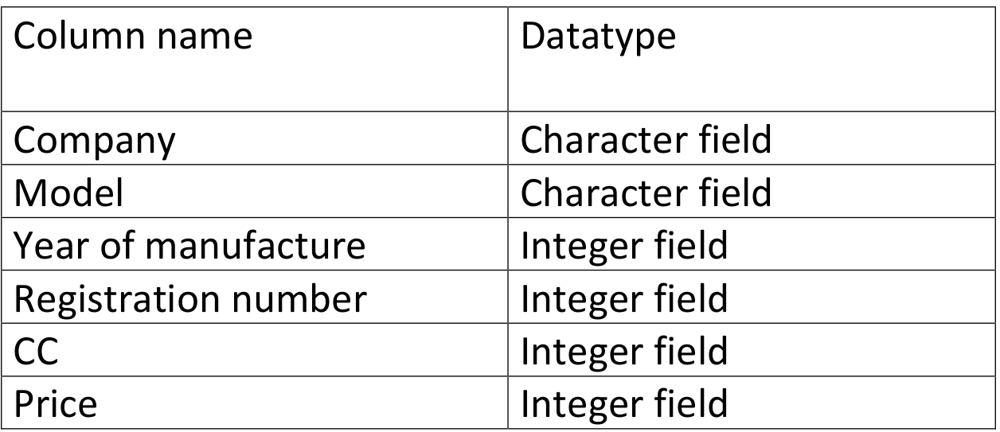
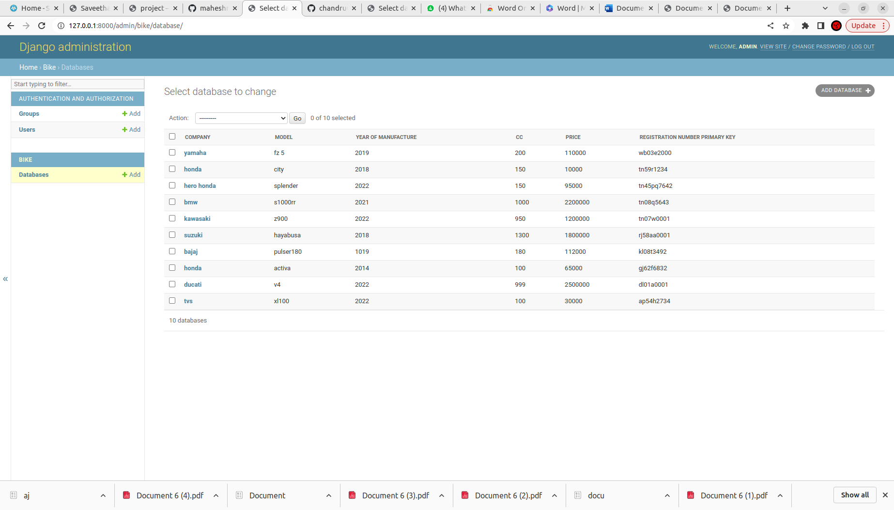

# Django ORM Web Application

## AIM
To develop a Django application to store and retrieve data from a database using Object Relational Mapping(ORM).

## Entity Relationship Diagram



## DESIGN STEPS

### STEP 1:
An Django application is created inside dataproject folder.

### STEP 2:
A python program is written to create a table to store and retrieve data.

### STEP 3:
The table is created with 6 fields in which the username field is made as PrimaryKey.

### STEP 4:
Then the project files migrated. A superuser is also created.

### STEP 5:
Now the server side program is executed .

### STEP 6:
The admin page of our website is accessed using username and password.

### STEP 7:
Records are added and saved in the table inside the database.


## PROGRAM

```
from django.db import models
from django.contrib import admin

class Database(models.Model):
    registration_number_primary_key = models.CharField(max_length=30, primary_key=True,unique=True)
    model = models.CharField(max_length=30)
    company = models.CharField(max_length=20)
    price = models. IntegerField(max_length=20)
    year_of_manufacture = models.IntegerField()
    cc = models.IntegerField()

class Admin(admin.ModelAdmin):
    list_display = ('company', 'model', 'year_of_manufacture', 'cc', 'price','registration_number_primary_key')

```

## OUTPUT




## RESULT
Thus a Django application is successfully developed to store and retrieve data from a database using Object Relational Mapping(ORM).